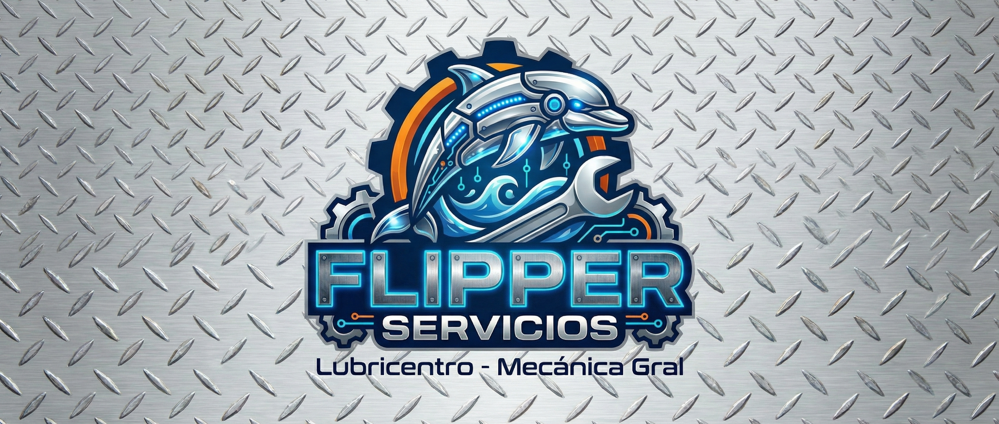

<p align="center">
    
</p>

<h1 align="center">FlipperBox</h1>

<p align="center">
    <strong>Sistema Integral de Gestión para Talleres Mecánicos y Lubricentros</strong>
</p>

<p align="center">
    <a href="https://laravel.com"></a>
    <a href="https://vuejs.org/"></a>
    <a href="https://inertiajs.com/"></a>
    <a href="https://tailwindcss.com/"></a>
    <a href="https://www.postgresql.org/"></a>
</p>

---

## 🚀 Sobre el Proyecto

**FlipperBox** es una plataforma SaaS diseñada para modernizar la gestión operativa del taller "Flipper Servicios y Lubricantes". Transforma procesos manuales y descentralizados en un ecosistema digital eficiente.

El sistema centraliza la gestión de clientes, vehículos, inventario y órdenes de trabajo, ofreciendo además un portal de autogestión para clientes y herramientas avanzadas como un **Chatbot con IA (RAG)** y notificaciones en tiempo real.

### ✨ Características Principales

- **🔐 Roles y Permisos (RBAC):** Paneles diferenciados para Administradores, Mecánicos y Clientes.
- **🚗 Gestión de Flota:** Historial clínico completo de cada vehículo.
- **📦 Inventario Inteligente:** Control de stock transaccional con cálculo automático de precios (Costo + IVA + Margen).
- **🔧 Órdenes de Trabajo:** Flujo completo desde la recepción hasta la facturación, con gestión de mano de obra y costos externos.
- **📅 Turnos y Cupos:** Sistema de reservas online con control de capacidad diaria.
- **🤖 Asistente IA:** Chatbot integrado con RAG para responder consultas sobre stock y servicios las 24/7.
- **🔔 Notificaciones Real-Time:** Avisos instantáneos (WebSockets) y por correo electrónico (Transactional Email).

---

## 🛠️ Stack Tecnológico

- **Backend:** Laravel 12 (PHP 8.3)
- **Frontend:** Vue 3 + Inertia.js
- **Base de Datos:** PostgreSQL (con extensión `pgvector` para IA)
- **Estilos:** Tailwind CSS
- **Tiempo Real:** Laravel Reverb (WebSockets) + Laravel Echo
- **IA:** Integración con Hugging Face (Embeddings) y Groq (LLM)
- **Calidad de Código:** Laravel Pint, ESLint, Prettier, Husky (Git Hooks)

---

## ⚙️ Instalación y Despliegue Local

Sigue estos pasos para levantar el proyecto en tu entorno local.

### Prerrequisitos
- PHP 8.3+
- Composer
- Node.js & NPM
- PostgreSQL

### Pasos

1.  **Clonar el repositorio**
    ```bash
    git clone https://github.com/tu-usuario/flipperbox.git
    cd flipperbox
    ```

2.  **Instalar dependencias**
    ```bash
    composer install
    npm install
    ```

3.  **Configurar entorno**
    ```bash
    cp .env.example .env
    php artisan key:generate
    ```
    *Configura tus credenciales de base de datos (DB_*) y servicios externos (REVERB, GROQ, HUGGINGFACE) en el archivo `.env`.*

4.  **Base de Datos y Seeders**
    ```bash
    php artisan migrate:fresh --seed
    ```

5.  **Ejecutar servidores**
    Necesitarás correr estos comandos en terminales separadas:
    ```bash
    # Servidor Web
    php artisan serve

    # Compilación de Assets (Vite)
    npm run dev

    # Servidor de WebSockets (Reverb)
    php artisan reverb:start

    # Worker de Colas (Para emails y notificaciones)
    php artisan queue:work
    ```

---

## 🧪 Testing y Calidad

El proyecto cuenta con pipelines de CI/CD y herramientas de calidad configuradas.

- **Ejecutar Tests (PHPUnit):** `php artisan test`
- **Formatear Código (Pint):** `./vendor/bin/pint`
- **Linting Frontend:** `npm run lint`

---

## 📄 Licencia

Este proyecto es de código abierto y está licenciado bajo la [MIT license](https://opensource.org/licenses/MIT).